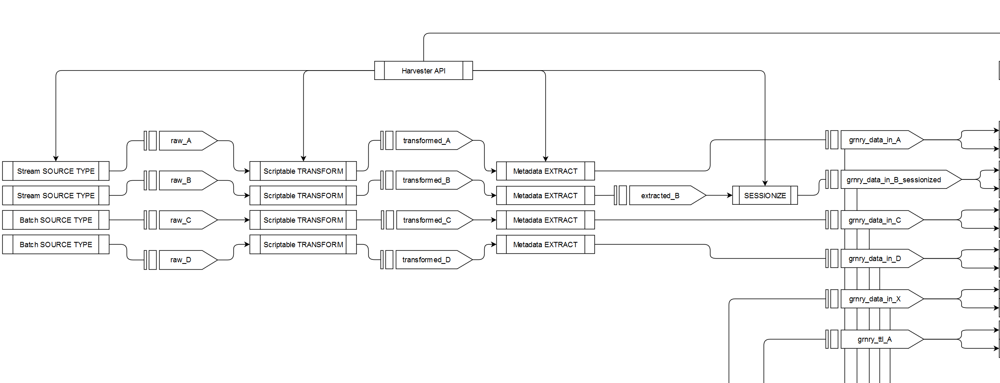

# Data-In

In this chapter, we are going to talk about the technical specification of a data-in pipeline. Let us clarify some names shortly.

### SCDF & Harvester API

SCDF stands for **Spring Cloud Data Flow** and is the framework that GRNRY uses to get data into the plattform. The **Harvester API** wraps the SCDF API to conveniently develop and manage Harvesters. A Harvesters consists of a Source Type, a Scriptable Transform, and a Metadata Extractor. Optionally, it can be appended by a Sessionzing Processor. The EventStore Sink writes raw data to a persistence layer. 

### Source Types

The source type defines where the data comes from. It can be configured to suit your specific needs for input data. See [here](source-types.md).

### Scriptable Transform

The Scriptable transform is the transformation, where you can implement your custom logic for extraction, such as simple mappings. For more information on the scriptable transform, see [here](scriptable-transform.md).

### Metadata Extractor

The metadata extractor extracts information, such as the correlation ID, the event type or the harvester name from the payload and sets it to the header fields. Here, you basically need to define mappings in Spring Expression Language. More information on the [metadata extractor](metadata-extractor.md).

### Sessionizing Processor

The Sessionizing processor is used to group data based on inactivity. More information on the [Sessionizing Processor](sessionizing-processor.md).

### EventStore Sink

The EventStore Sink persists data from the data\_in\_grnry\_&lt;event&gt; topic and persists it into the database. More information on the [Eventstore Sink](eventstore-sink.md).

### API Calls

Consult the [Granary Access Clients Reference](../../../operator-reference/identity-and-access-management/granary-access-clients.md#harvester-api) for roles a user needs to interact with Harvester API.

Check out the user guide [How to run a Harvester](../../../learning-grnry-1/data-in/how-to-run-a-harvester/) or refer to the [Harvester API](../../api-reference/harvester-api.md) documentation for full details.

