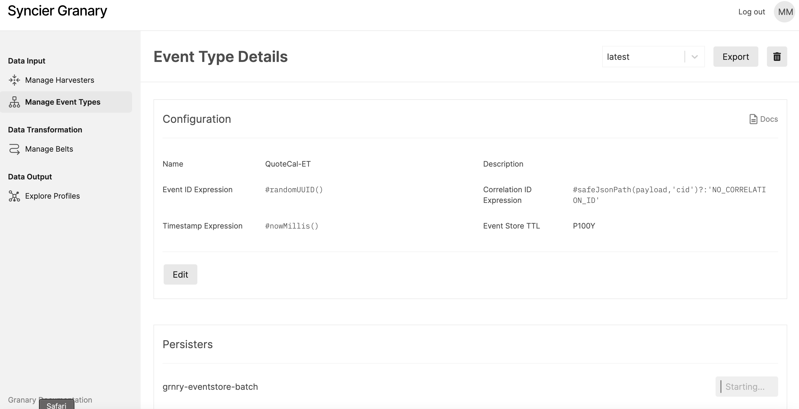
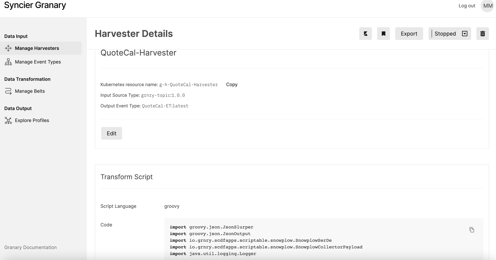
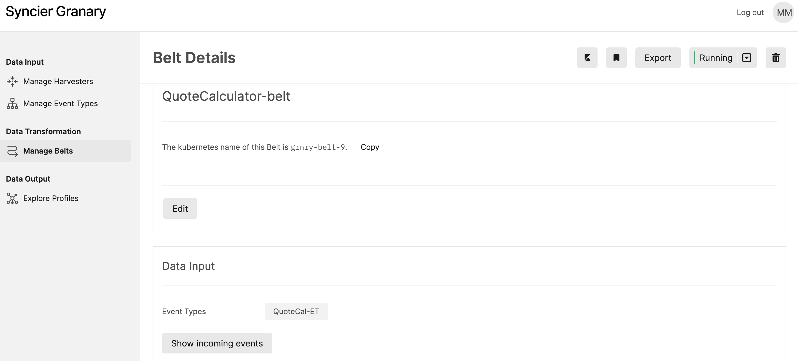
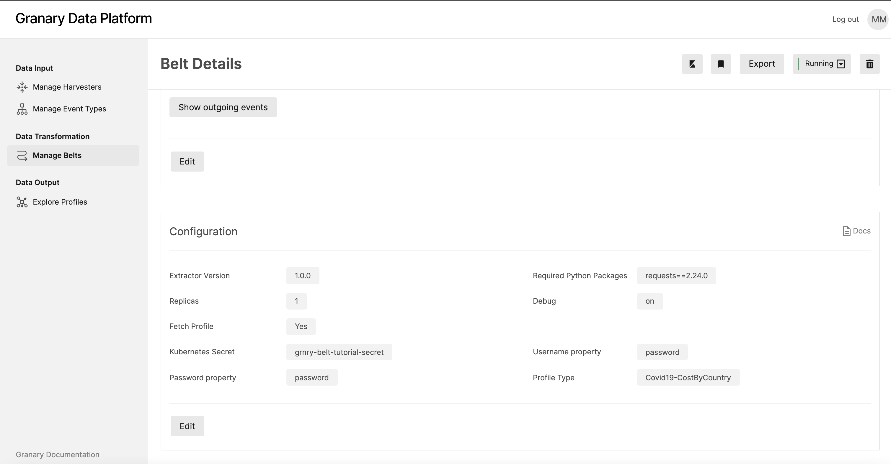
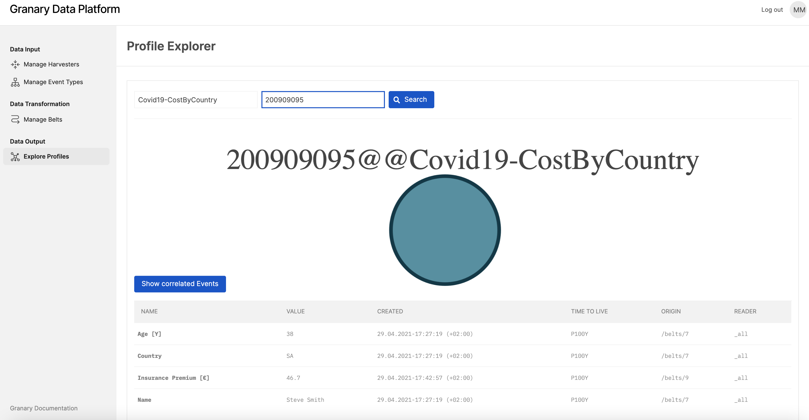

# Pipeline 2: Calculate Quotes

Once the Profile from [Pipeline 1](create-profiles-for-new-leads.md) is created, we can fetch the profile in the Belt and with its details calculate COVID-19 adjusted insurance premiums and update the value back to the respective profile.

### 1. Creating Quote Request Event Type

Select the 'Manage Event Types' on the left side pane and create Event Type `QuoteCalET-<yourName>` with the following details:  



Here the configurations, you need to copy: 

> Name: `QuoteCalET-<yourName>`
>
> Event ID Expression: `#randomUUID()`
>
> Correlation ID Expression: `#safeJsonPath(payload,'cid')?:'NO_CORRELATION_ID'`

### 

### 2. Configure Harvester

Select the 'Manage Harvesters' on the left side pane, and create `QuoteCal-Harvester-<yourName>` with the Source Type "Grnry Topic" in version 1.0.0 and select the Event Type `QuoteCalET-<yourName>` which we have created above with `latest` version. 



Also, we need to add a transform script like: 

```groovy
import groovy.json.JsonSlurper
import groovy.json.JsonOutput
import io.grnry.scdfapps.scriptable.snowplow.SnowplowSerDe
import io.grnry.scdfapps.scriptable.snowplow.SnowplowCollectorPayload
import java.util.logging.Logger

// deserialize thrift format
snowplowEvent = SnowplowSerDe.deserialize(payload)

String appId = 'Covid19'
String useCase = 'CostByCountry'
String personProfile = '0'
String body = snowplowEvent.getBody()
println(body)

filter(appId, useCase, personProfile, body)

def filter(appId, useCase, personProfile, body){
    if (hasJsonStructure(body)){
        //parse full snowplowEventBody
        JsonSlurper jsonSlurper = new JsonSlurper()
        def snowplowBody = jsonSlurper.parseText(body)

        if (snowplowBody?.appid?.equals(appId) &&
            snowplowBody?.usecase?.equals(useCase) &&
            snowplowBody?.personprofile?.equals(personProfile)) {
            Logger logger = Logger.getLogger('Logger')
            logger.info('Save event for ' + appId + ': ' + body)
            return body
        }

        // event did not have the right values -> skip
        return null
    }

    // event did not have the right format -> skip
    return null
}

def hasJsonStructure(String body){
    if (body == null){
        return false
    }
    cleaned_body = body.trim()
    return cleaned_body.startsWith('{') && cleaned_body.endsWith('}')
}
```

In the transform script we are parsing the data which we are getting from the snowplow event. The filter function at line number 16 getting called to compares the values of `appId`, `useCase` and `personProfile = 0`, if the event contains the flag as `0` then it will direct to the quote calculation path and return the result accordingly.

Start the Harvester using the left side dropdown of the screen and check if it is in running state :


### 

### 3. Calculate Quote in the Belt

Select the 'Manage Belts' section from the left side of the page and lick on button 'New Belt'. Specify the name of Belt `QuoteCalculator-Belt-<yourName>` and select the Event Type `QuoteCalET-<yourName>` created above.

The belt will look like: 



In the Belt Configuration we must select the Fetch Profile = “Yes”. Because we are processing on the profiles which are already created using RealTime-Belt. 

And the other parameters Kubernetes Secret, Username Property, Password Property and Profile Type need specification:

> "fetchProfile": "TRUE", 
>
>     "profileType": "Covid19-CostByCountry", 
>
>     "secret": "grnry-belt-tutorial-secret", 
>
>     "secretUsername": "username", 
>
>     "secretPassword": "password"


Secret grnry-belt-tutorial-secret is already created and applied.


If we need to use logging, then we should specify the configuration  

Here in the Belt function we are making an external API call to the COVID-19 API. Hence, in this pipeline we must specify PIP import requests in the belt function and need to specify the value in Belt configuration for the following parameter:

> "requirementsPy": "requests==2.24.0"



Again, we need to add a transformation function in Belt:

```python
import requests
import json
from datetime import datetime
import traceback

def lookup(dictionary, keys):
    if type(dictionary) == type(''):
        dictionary = json.loads(dictionary)
    try:
        if len(keys) > 1:
            value = lookup(dictionary[keys[0]], keys[1:])
        else:
            value = dictionary[keys[0]]
        return value
    except:
        return None

def execute(event_headers, event_payload, profile=None):
    profile_corr_id = event_headers['grnry-correlation-id']
    basepremium = 10
    baseUrl = 'https://api.covid19api.com/'
    try:
        if profile is not None:
            payload = lookup(profile, ['jsonPayload'])

            age = lookup(payload, ['Age [Y]'])
            latest = lookup(age, ['_latest'])
            _v = str(lookup(latest, ['_v']))
            age_jsonpayload = int(_v)

            country = lookup(payload, ['Country'])
            latest = lookup(country, ['_latest'])
            _v = str(lookup(latest, ['_v']))
            country_jsonpayload = str(_v)
            country_url = baseUrl + 'countries'
            cresponse = requests.request('GET', country_url)
            country_response = json.loads(cresponse.text.encode('utf8'))
            for country in country_response:
                if country['ISO2'] == country_jsonpayload:
                    country = country['Country']
                    url = (baseUrl + 'live/country' + '/' + country)
                    response = requests.request('GET', url)
                    response_json = json.loads(response.text.encode('utf8'))
                    operation = '_set'
                    reader = '_all'
                    profile_type = 'Covid19-CostByCountry'
                    current_datetime = str(datetime.now().date())  # current date
                    for livecase in response_json:
                        latestdate = str((livecase['Date'].split("T"))[0])
                        if latestdate == current_datetime:
                            confirmedcases = livecase['Confirmed']
                            deathscases = livecase['Deaths']
                            mrate = deathscases * 100 / confirmedcases
                            mortalityrate = float("{:.3f}".format(mrate))
            if 30 <= int(age_jsonpayload) <= 40:
                insurancepremium = basepremium * mortalityrate + 30
            if 40 < int(age_jsonpayload) <= 50:
                insurancepremium = basepremium * mortalityrate + 40
            if 50 < int(age_jsonpayload) <= 60:
                insurancepremium = basepremium * mortalityrate + 50
            if 60 < int(age_jsonpayload) <= 70:
                insurancepremium = basepremium * mortalityrate + 60
            if int(age_jsonpayload) > 70:
                insurancepremium = basepremium * mortalityrate + 70

            update = Update(profile_corr_id, ['Insurance Premium [€]'], operation=operation)
            update.set_value(str(insurancepremium), reader=reader)
            update.set_type(profile_type)
        else:
            print('No Profile with correlation_id ', profile_corr_id, ' found!!!')
    except:
        print("Exception Occured while processing the profile ")
        tb = traceback.format_exc()
        print(tb)
    return update
```

The function describes the calculation of quote for COVID-19 and returns the insurance premium.  At line 22 we define the external API's base url \([https://api.covid19api.com/](https://api.covid19api.com/')\). From the Profile payload lookup \(lines 27-35\), we get the latest profile values for `age` and `country code`. We fetch all countries from the external API \(/countries\) at line 37. We then match the resulting array of fetched country codes with the `country code` from the profile payload at line 39. If matches, then save the country name in the `country name` variable. Further, using the country name, we fetch the current COVID-19 figures for this country from the external API at line 43 \(/live/country/&lt;country&gt;\).  
From the API response, we fetch the value of `Confirmed cases` and `Death cases` of current date and calculate the daily `mortality rate` from the above values at line 55. Finally, using the combination of `mortality rate` and `age` of the person calculate the insurance premium as a result. At line no 46, profile\_type is defined with combination of `appid`  `-`  `usecase` received the event at belt which looks like `Covid19-CostByCountry.`Once all calculations are done, update the profile back to the Profile Store at line 67.


### 4. Validate Calculated Quote in the Profile Explorer

To test the pipeline, send a HTTP `POST` request with the following JSON body to the Snowplow API endpoint of demo environment \(`<host>/api/com.snowplowanalytics.snowplow/tp2`\):

```javascript
{ 
  "personprofile": "0", 
  "appid": "Covid19", 
  "usecase": "CostByCountry", 
  "cid": "200909095", 
  "value": "12" 
}
```


You can send this event using Granary's Postman collection. See Prerequisites.



The **`personprofile`** must be "0", Do not change the value of `personprofile.`


When the event is triggered, we can also check at the Harvester and Belt's 'Data Out' Event Viewer: 


The profile gets updated with the value of calculated insurance premium in the Profile Store:

While searching the profile in Profile Explorer we need to specify : 

> Profile Type : Covid19-CostByCountry
>
> Correlation id : cid value from the postman request




