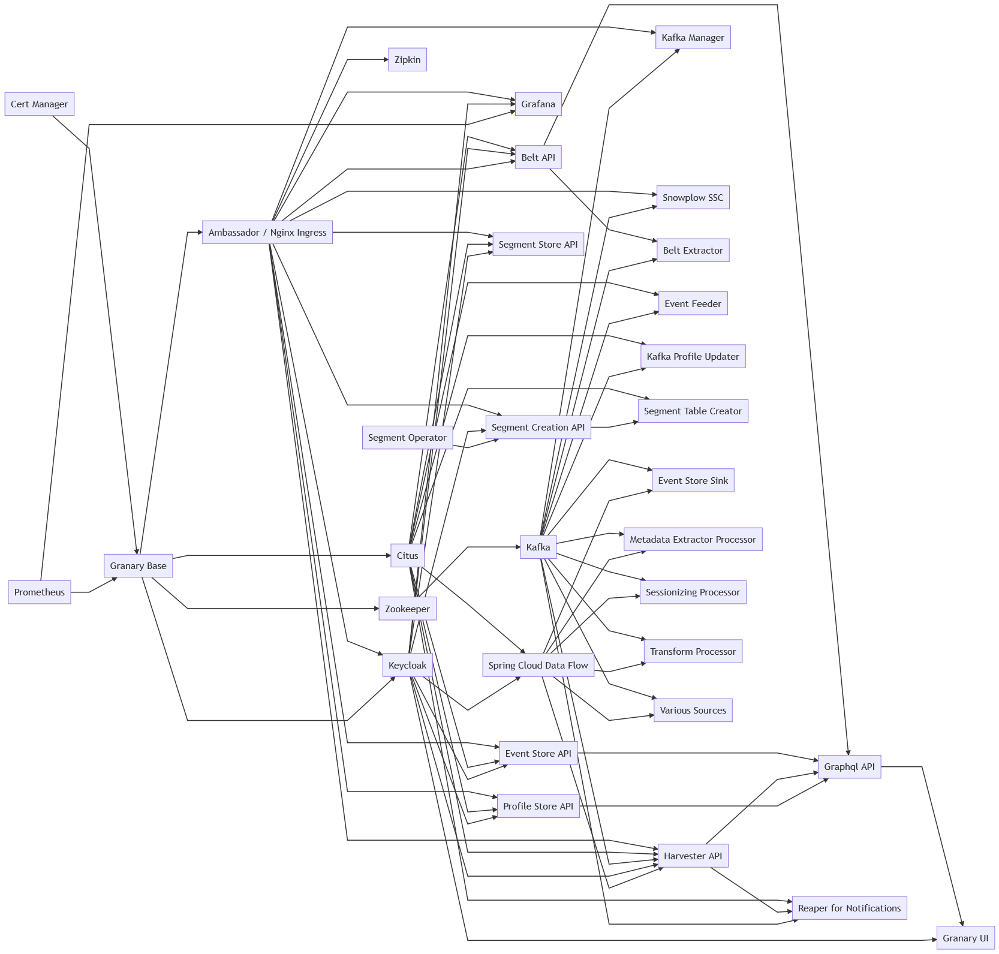

# Installation

Access Credentials for Granary's source code, Docker Images, and Helm Charts can be obtain via analytics-support@syncier.com.

## Helm Chart Repositories

The Stable Helm Charts are to be used for deployment of Granary components with a release version \(see [Granary Release Notes](../granary-release-notes/)\). By default, the Helm Chart version is also used for the Docker Image Tag of the corresponding Granary component.

In turn, the Incubator Helm Chart Repo always deploys the latest commit on the master branch of the respective Granary component. Thus, the charts might be under development and change quickly over time.

### Stable Helm Chart Repo

`helm repo add --username <username> --password <password> grnry-stable https://hub.syncier.cloud/chartrepo/grnry`

### Incubator Helm Chart Repo

`helm repo add --username <username> --password <password> grnry-incubator https://hub.syncier.cloud/chartrepo/grnry-snapshot`

### Open Source Helm Chart Repo

`helm repo add grnry-oss https://hub.syncier.cloud/chartrepo/grnry-oss`

## Prerequisites

* Kubernetes 1.14.0+ cluster up and running 
* Kubernetes Namespace set in ~/.kube/config 
* Helm 3.+ installed locally
* Granary Stable & Open Source Helm Repo added locally

## Before you start ...

... ensure that

* there is a default storage class set in Kubernetes.
* there is an ingress service available, e.g. nginx or Ambassador.
* there is a [Prometheus Server](https://prometheus.io/) available to scrape the component's metric endpoint.
* there is basic Granary configuration deployed, see [Granary Base Helm Chart](https://github.com/syncier/grnry-base-deployment/tree/master/helm).
* there is a TLS certificate for your base FQDN as Kubernetes secret in the cluster to SSL-encrypt ingresses, e.g. using [Cert-Manager](https://docs.cert-manager.io/en/latest/)'s certificate resource
* there is a PostgreSQL user as Kubernetes secret if you do not choose to run Citus PostgreSQL within the Granary installation.
* there are Maven repository access credentials as Kubernetes secret in the cluster to download Spring Cloud Data Flow \(SCDF\) metadata jars.

## Deployment Dependencies

